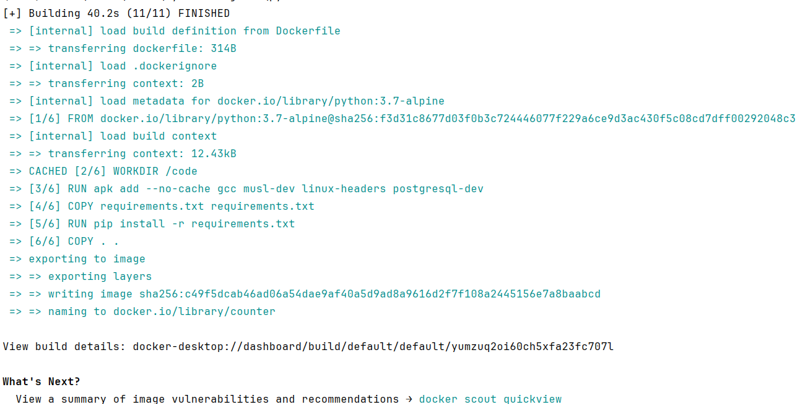
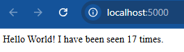
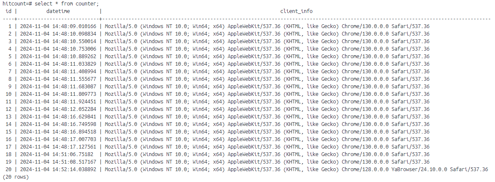

# python-flask-bd

Копируем файлы с шаблона приложения: [gist](https://gist.github.com/nzhukov/a2ba90e8d801e66d1319ee2bf962bc28#file-app-py)

В качесте базы данных была выбрана PostgreSQL:

Перепишем приложения для работы с БД (для подключения к бд используется библиотека ```psycopg2```):
```aiignore
# Database params
DB_HOST = "db"
DB_NAME = "hitcount"
DB_USER = "postgres"
DB_PASSWORD = "password"

def create_table():
    with psycopg2.connect(host=DB_HOST, database=DB_NAME, user=DB_USER, password=DB_PASSWORD) as conn:
        with conn.cursor() as cursor:
            cursor.execute('''
                CREATE TABLE IF NOT EXISTS counter (
                    id SERIAL PRIMARY KEY,
                    datetime TIMESTAMP NOT NULL,
                    client_info TEXT NOT NULL
                );
            ''')
            conn.commit()
```

Также с новым форматом хранения данных, исправим добавление значений в бд:
```aiignore
def get_hit_count(client_info):
    current_time = datetime.now()
    with psycopg2.connect(host=DB_HOST, database=DB_NAME, user=DB_USER, password=DB_PASSWORD) as conn:
        with conn.cursor() as cursor:
            count = cursor.execute(
                'INSERT INTO counter (datetime, client_info) VALUES (%s, %s) RETURNING id;',
                (current_time, client_info)
            )
            new_id = cursor.fetchone()[0]
            conn.commit()
            return new_id
```

При запросе будет выполняться функция create_table и создавать базу если её ещё нету
```aiignore
@app.route('/')
def hello():
    create_table()
    client_info = f"{request.user_agent.string}"
    count = get_hit_count(client_info)
    return 'Hello World! I have been seen {} times.\n'.format(count)
```
В файле ```requirements.txt``` заменим ```redis``` на ```psycopg2-binary```   
В ```Dockerfile``` добавим зависимости для работы с ```postgresql```   
```aiignore
RUN apk add --no-cache gcc musl-dev linux-headers postgresql-dev
```
Соберём образ приложения из докерфайла ```docker build -t counter -f Dockerfile .```


Заходим в докерхаб, тегируем образ и пушим:
```aiignore
docker login
docker tag counter monssena/counter
docker push counter monssena/counter
```

В ```docker-compose.yaml``` заменим ```redis``` на ```postgres```:

```aiignore
version: "3.8"
services:
  web:
    image: monssena/counter
    depends_on:
      - db
    ports:
      - "5000:5000"
    environment:
      FLASK_ENV: development

  db:
    image: postgres:alpine
    environment:
      POSTGRES_USER: postgres
      POSTGRES_PASSWORD: password
      POSTGRES_DB: hitcount
    volumes:
      - pgdata:/var/lib/postgresql/data

volumes:
  pgdata:
```

Выполним ```docker-compose.yaml``` и проверим работу приложения:   


Также посмотрим данные сохраняемые в БД   
